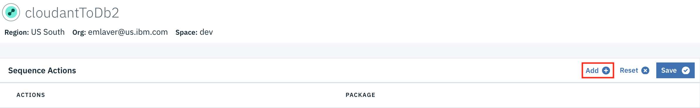
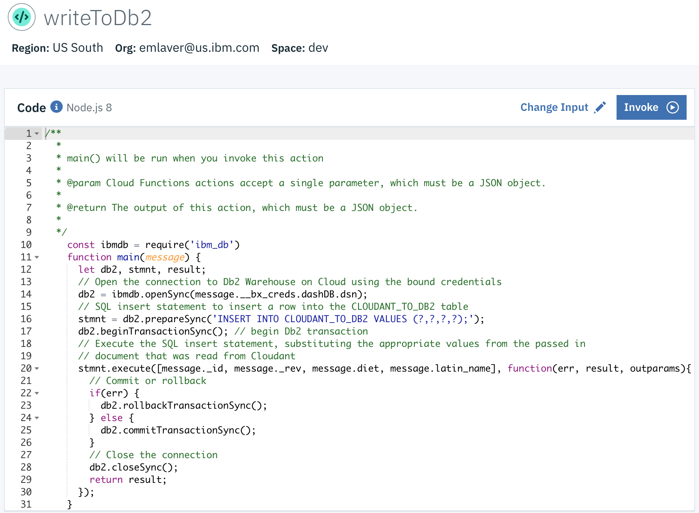
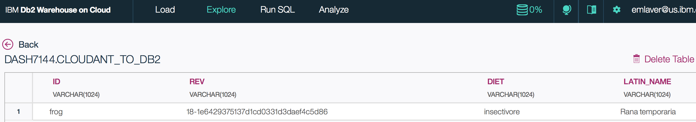

# Using Cloud Functions to copy data from Cloudant to Db2 Warehouse on Cloud

This is a tutorial to use IBM Cloud Functions to respond to a new document in Cloudant
and write the document into a table in Db2 Warehouse on Cloud. 
This tutorial will demonstrate how to:

1. Create the `cloudant-to-db2` Cloudant database
1. Create a Db2 Warehouse on Cloud table to house your data
1. Create a IBM Cloud Functions sequence
    1. Add a public Cloudant action to read documents
1. Create an action to extract the Cloudant JSON document and insert
 that data into a table in Db2 Warehouse on Cloud
1. Trigger a function in response to changes in a Cloudant database
1. Enable the sequence to be invoked by the Cloudant trigger
1. Test the triggered sequence by creating a Cloudant document and viewing the 
data in a Db2 table

**N.B. This is an example only intended as a _starting point_ for using IBM Cloud Functions to extract data from Cloudant and insert into Db2 Warehouse on Cloud. It is _not_ intended as a drop-in replacement for the deprecated Cloudant warehouse integration. In particular this example does not perform `upsert` or handle document deletion.**

## Prerequisites
Before you begin you will need:
* [IBM Bluemix CLI](https://console.bluemix.net/docs/cli/reference/bluemix_cli/get_started.html#getting-started) and [IBM Cloud Functions CLI](https://console.bluemix.net/docs/openwhisk/bluemix_cli.html#cloudfunctions_cli) installed on your machine
* An [IBM Cloudant](https://console.bluemix.net/catalog/services/cloudant-nosql-db) database instance
* An [IBM Db2 Warehouse on Cloud](https://console.bluemix.net/catalog/services/dashdb) instance

## Instructions
1. Log in to the Cloudant dashboard and create the `cloudant-to-db2` Cloudant database

1. Create a Db2 table to house your data
    1. `Manage`>`Open` to get the Db2 Warehouse on Cloud dashboard, then choose `Run SQL`
    1. For `cloudant-to-db2` database, create a table called CLOUDANT_TO_DB2 with `varchar` columns 
    for id, rev, diet and latin_name by running this SQL statement:
        
        `CREATE TABLE CLOUDANT_TO_DB2 (id VARCHAR(1024), rev VARCHAR(1024), diet VARCHAR(1024), latin_name VARCHAR(1024))`
         
    
    1. Add service credentials to your Db2 Warehouse on Cloud instance
       (`Service credentials` then press `New credential`)
1. Create a sequence that includes a Cloudant action to read documents
    1. Log in to your IBM Bluemix account and select the `Actions` tab on [IBM Cloud Functions](https://console.bluemix.net/openwhisk/)
    1. Press the `Create` button
    1. Press `Create Sequence`
    1. Choose a name for the sequence e.g. `cloudantToDb2`
    1. Choose whatever package you want to store it in (we'll use the default package)
    1. Create a Cloudant action for the sequence:
        1. Select `Use Public` and click on `Cloudant`
        1. Choose the `read-document` action from the drop down
        1. Select new binding and choose a name for the package binding e.g. `myCloudant`
        1. Choose the Cloudant instance from the dropdown or enter details for another Cloudant account
        1. Add `cloudant-to-db2` to the `Database` field
    1. Press the `Create` button
    
1. Create an action to write a Cloudant document to Db2
    1. IBM Cloud > Functions > Actions
    1. Click on the `cloudantToDb2` sequence
    1. Click `Add`
    
    1. Choose a name for the action e.g. `writeToDb2`
    1. Choose whatever package you want to store it in (we'll use the default package)
    1. Choose the Node.js 8 runtime
    1. Press the `Create & Add` button
    
    1. Press the `Save` button
    1. Click on the `writeToDb2` action
    
    1. In a terminal window, bind the service credentials to the `writeToDb2` action by running the bluemix CLI command:
    `bx wsk service bind dashdb writeToDb2`   
    You should see a success output like `Service credentials 'Credentials-1' from service 'Db2 Warehouse-er' bound to action 'writeToDb2'`
    **Note**: 
    If you have multiple Db2 Warehouse on Cloud service credentials you need to identify the correct credential to bind with additional CLI args
    1. Replace the `main` function in the `writeToDb2` action code with this sample code:
    ```js
    const ibmdb = require('ibm_db')
    function main(message) {
      let db2, stmnt, result;
      // Open the connection to Db2 Warehouse on Cloud using the bound credentials
      db2 = ibmdb.openSync(message.__bx_creds.dashDB.dsn);
      // SQL insert statement to insert a row into the CLOUDANT_TO_DB2 table
      stmnt = db2.prepareSync('INSERT INTO CLOUDANT_TO_DB2 VALUES (?,?,?,?);');
      db2.beginTransactionSync(); // begin Db2 transaction
      // Execute the SQL insert statement, substituting the appropriate values from the passed in
      // document that was read from Cloudant
      stmnt.execute([message._id, message._rev, message.diet, message.latin_name], function(err, result, outparams){
        // Commit or rollback
        if(err) {
          db2.rollbackTransactionSync();
        } else {
          db2.commitTransactionSync();
        }
        // Close the connection
        db2.closeSync();
        return result;
      });
    }
    ```
    1. Press `Save`
    
1. Create a Cloudant trigger
    1. Select the IBM Cloud `Functions` catalog category, then select the `Triggers` tab 
    1. Select `Create Trigger`
    1. Choose Trigger type `Cloudant`
    1. Choose a name for the trigger e.g. `cdtExample`
    1. Choose or create whatever package you want to store it in (we'll use the default package)
    1. Create or Select a Cloudant instance, or enter details for another Cloudant account
    1. Add `cloudant-to-db2` to the `Database` field
    1. Press the `Create` button
    
1. Connect the sequence to the Cloudant trigger
    1. In the `cdtExample` trigger, press the `Add+` button
    1. Press `Select Existing`
    1. Choose the `cloudantToDb2` sequence you made earlier
    1. Press the `Add` button
    
    1. Verify that the checkbox in the **Connection** column is enabled for the `cloudantToDb2` sequence
    
    
## Test the triggered sequence

1. Write a document into your IBM Cloudant database
    1. Login to your Cloudant Dashboard and open the `cloudant-to-db2` database
    1. Select `Create Document` and paste the JSON below:
    ```json
    {
      "_id": "frog",
      "diet": "insectivore",
      "latin_name": "Rana temporaria"
    }
    ```
    1. Press `Create Document` again to create the document
1. View the IBM Cloud Functions Monitor dashboard
    1. In the `Activity Log`, you should see five new messages with green check marks for `writeToDb2`, `cloudant/read-document`, `cloudantToDb2`,
    `cdtExample`, and `cloudantToDb2_cdtExample`
    **Note**: You may need to press the refresh button as the `writeToDb2` action can takes several seconds to show in the logging
    
1. View the data in the Db2 Warehouse on Cloud table
    1. In the Bluemix dashboard, go to your Db2 Warehouse on Cloud service
    1. On the **Manage** tab, click the **Open** button:
    
    1. In the Db2 console, click on the **Explore** tab and select the schema that matches your username
    1. Select the `CLOUDANT_TO_DB2` table under the selected schema and click **View Data**:
    
    1. You should now see the data for the `frog` document:
    

## References

* [IBM Cloud Docs - Cloudant NoSQL DB](https://console.bluemix.net/docs/services/Cloudant/cloudant.html#overview)
* [IBM Cloud Functions Cloudant trigger](https://github.com/IBM/ibm-cloud-functions-cloudant-trigger)
* [IBM Cloud Functions Cloudant data processing](https://github.com/IBM/ibm-cloud-functions-data-processing-cloudant)
* [IBM Cloud Functions catalog](https://console.bluemix.net/docs/openwhisk/openwhisk_catalog.html#openwhisk_ecosystem)
* [New Node.js 8 runtime for IBM Cloud Functions](https://www.ibm.com/blogs/bluemix/2017/12/new-node-js-8-runtime-ibm-cloud-functions/)
* [Simplify binding your IBM Cloud services to serverless Functions](https://www.ibm.com/blogs/bluemix/2017/11/simplify-binding-ibm-cloud-services-serverless-functions/)
* [IBM Db2 bindings for Node.js](https://github.com/ibmdb/node-ibm_db)
* [IBM Db2 Warehouse on Cloud - Node.js Hello World Sample](https://github.com/IBM-Cloud/dashdb-nodejs-helloworld)
* [IBM Cloud Functions Node.js Runtime](https://github.com/ibm-functions/runtime-nodejs)
* [Access Db2 from IBM Cloud Functions the Easy Way (Node.js)](http://blog.4loeser.net/2018/01/access-db2-from-ibm-cloud-functions_25.html)
