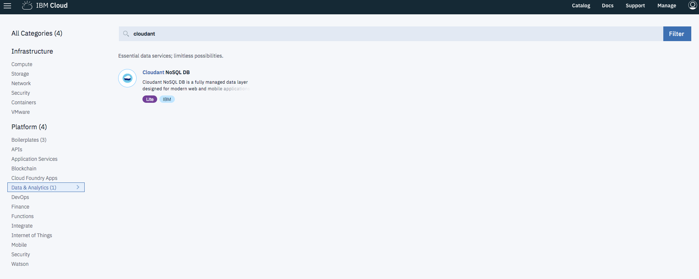
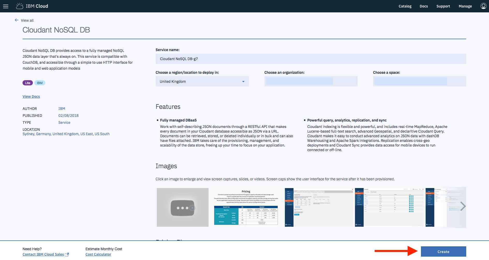
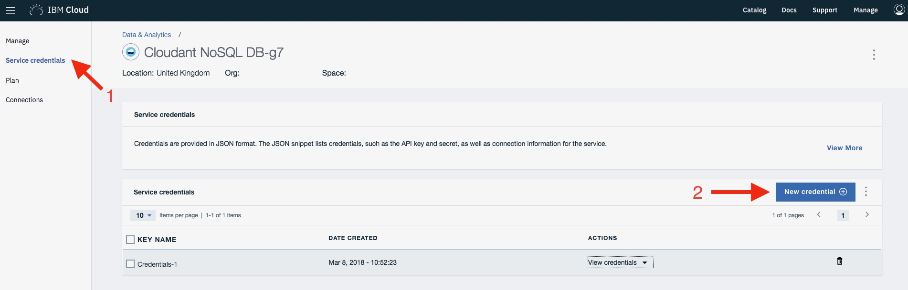
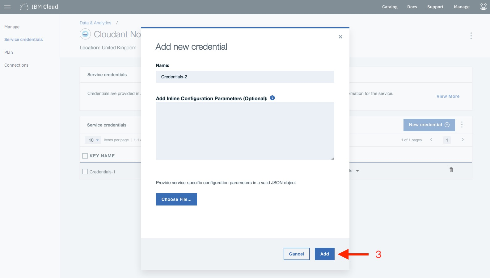
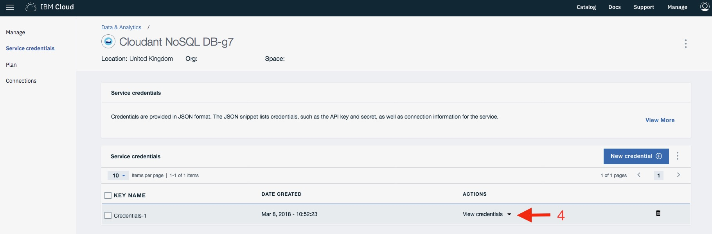

# Creating an IBM Cloudant instance

1. Create an [IBM Cloudant](https://console.bluemix.net/catalog/services/cloudant-nosql-db) instance.

1. Create Service Credentials for IBM Cloudant.

1. Make a note of your service credentials to use later.

