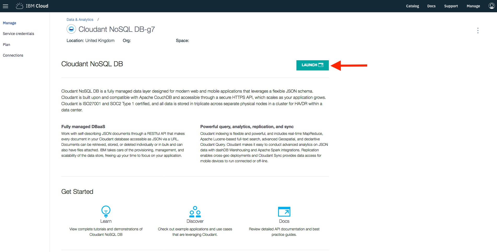
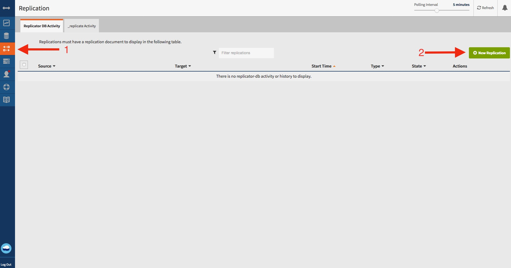
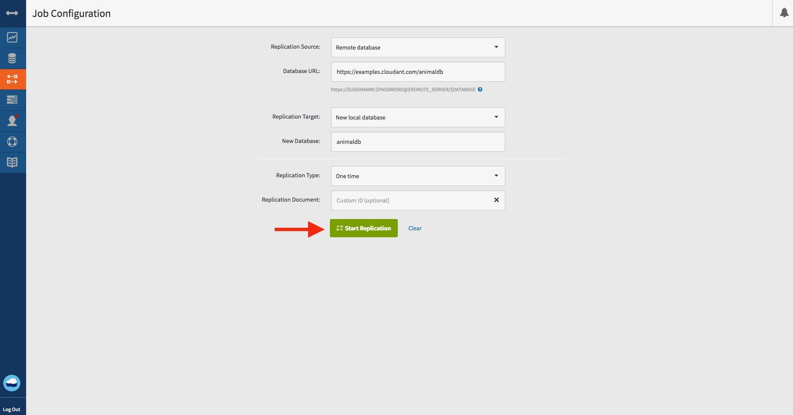
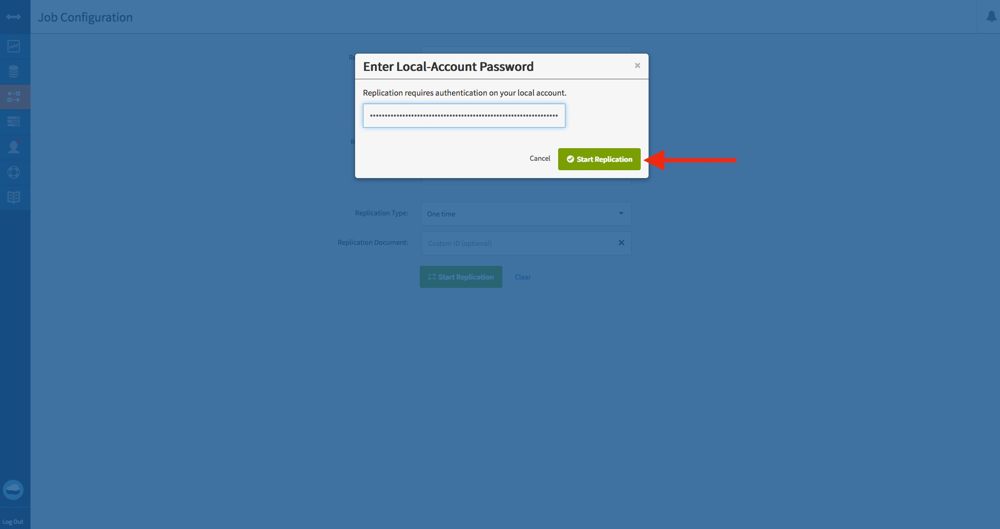
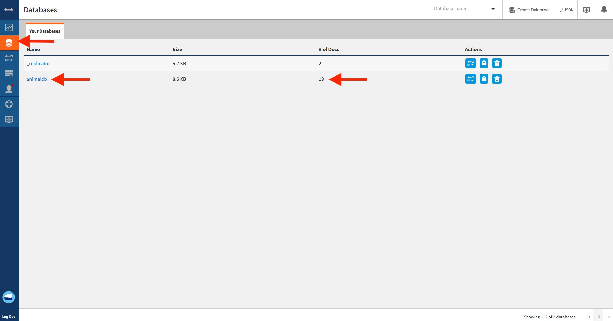

# Replicate the animaldb example database into your IBM Cloudant instance

1. Launch the Cloudant dashboard.

1. On the "Replication" tab, create a new replication.

1. Select a remote database source and enter the animaldb example URL `https://examples.cloudant.com/animaldb`.
1. Select a local database target and enter the name `animaldb`.
1. Make it a "one time" replication and start the replication.

1. Enter your Cloudant password from the service credentials you generated previously.

1. The replication will be scheduled and complete in a short while. You can
observe the status of the replication and also check your new `animaldb`
database replica.

