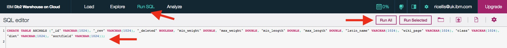

# Create a SQL table

1. Create a Db2 table to house the data.
    1. `Manage`>`Open` to get the Db2 Warehouse on Cloud dashboard, then choose `Run SQL`.
    1. Create a table called `ANIMALS` with appropriate columns for the data by pasting this SQL statement: 
        `CREATE TABLE ANIMALS ("_id" VARCHAR(1024), "_rev" VARCHAR(1024), "_deleted" BOOLEAN, "min_weight" DOUBLE, "max_weight" DOUBLE, "min_length" DOUBLE, "max_length" DOUBLE, "latin_name" VARCHAR(1024), "wiki_page" VARCHAR(1024), "class" VARCHAR(1024), "diet" VARCHAR(1024));`
    
    1. Press the `Run All` button to execute the SQL statement.
