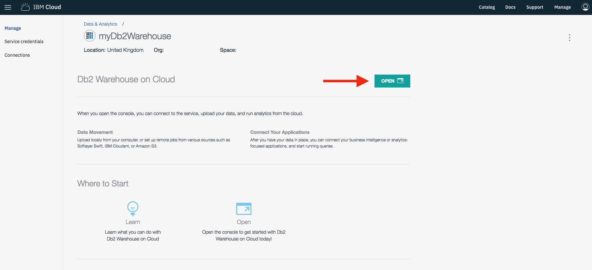
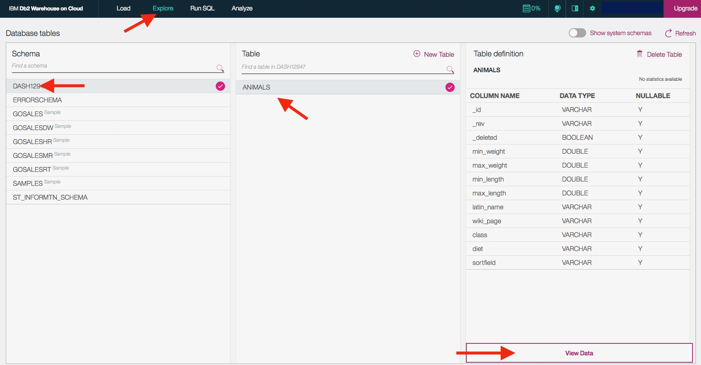
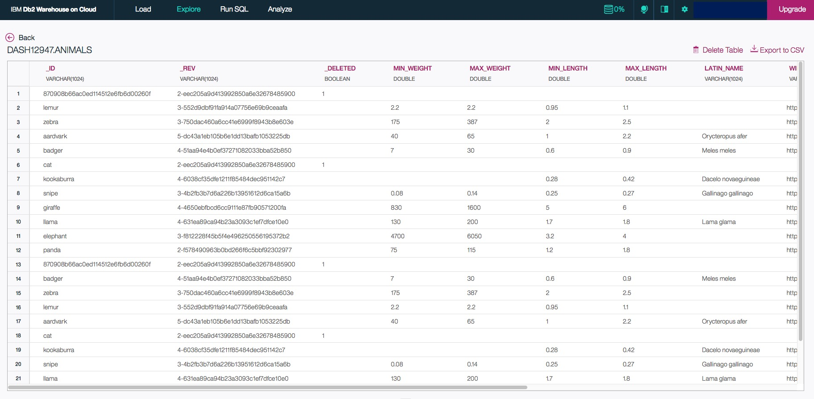

# Viewing the data written to Db2 Warehouse on Cloud

1. In the IBM Cloud dashboard, go to your Db2 Warehouse on Cloud service.
1. On the **Manage** tab, click the **Open** button.

1. In the Db2 console, click on the **Explore** tab and select the schema that matches your username.
1. Select the table (e.g. `ANIMALS`) under the selected schema and click **View Data**.

1. You should now see the table data.

