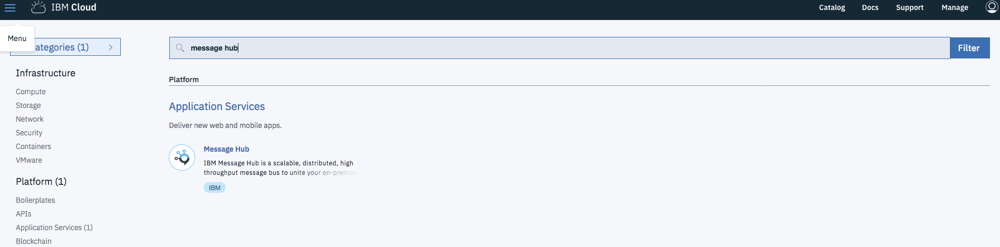
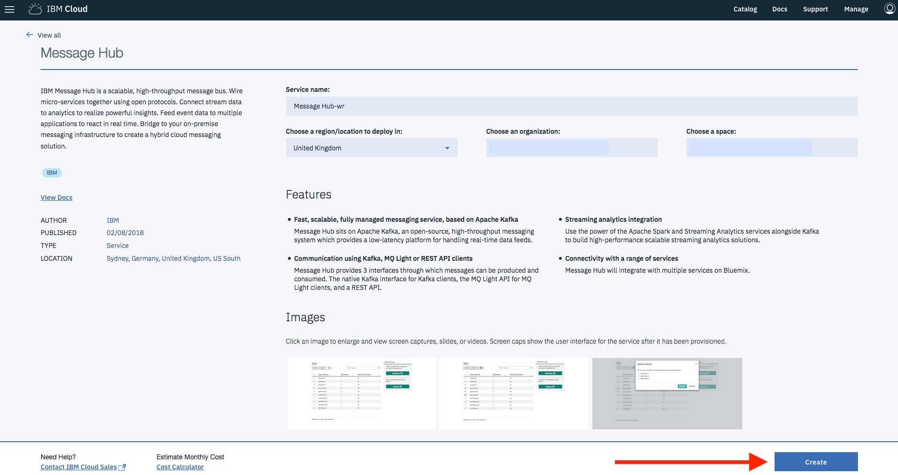
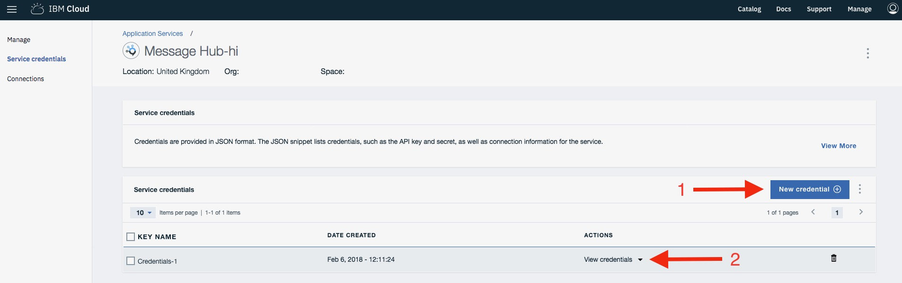
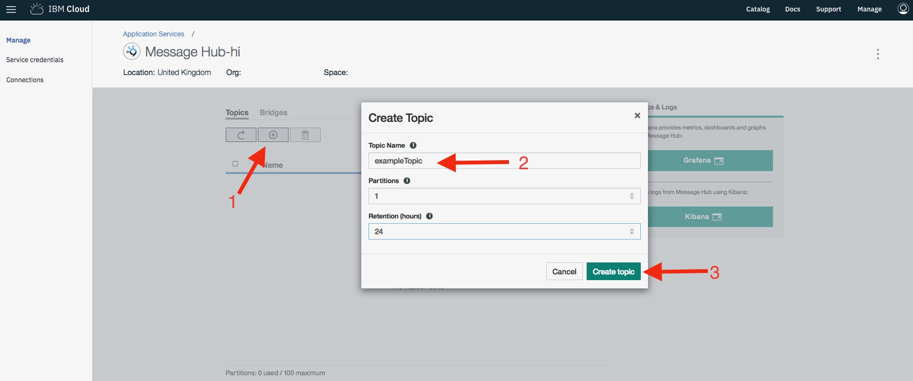

# Using IBM Message Hub and Apache Kafka to copy documents from Cloudant to Db2 Warehouse on Cloud

This tutorial will use Apache Kafka Connect to publish messages from a Cloudant
database to an IBM Cloud Message Hub topic. The messages will then be consumed by
Apache Kafka Connect's JDBC connector to write to a Db2 Warehouse on Cloud table.

This tutorial will demonstrate how to:
1. [Set up Cloudant, Message Hub and Db2 Warehouse on Cloud.](#setting-up-ibm-cloud-services)
1. [Set up Apache Kafka Connect to connect to Message Hub.](#setting-up-apache-kafka-connect)
1. [Configure Apache Kafka Connect with `kafka-connect-cloudant` to produce messages for Cloudant documents.](#configure-kafka-connect-cloudant-as-a-source-connector)
1. [Configure Apache Kafka Connect with `kafka-connect-jdbc` to consume messages from a topic and write to Db2 Warehouse on Cloud.](#configure-kafka-connect-jdbc-as-a-sink-connector)
1. [Run Apache Kafka Connect in a standalone worker configuration.](#running-apache-kafka-connect)

**N.B. This is an example only intended as a _starting point_ for using IBM Message Hub and Apache Kafka Connect to extract data from Cloudant and insert into Db2 Warehouse on Cloud. It is _not_ intended as a drop-in replacement for the deprecated Cloudant warehouse integration. In particular this example does not create or alter Db2 tables or handle document deletion.**

# Setting up IBM Cloud services

## Cloudant

1. [Create an IBM Cloudant](../cloudant/create.md) instance.
1. [Replicate the tutorial data](../cloudant/replicate.md).

## Message Hub

1. Create an [IBM Message Hub](https://console.bluemix.net/catalog/services/message-hub) service instance.


1. Create Service Credentials for IBM Message Hub.

1. Use the Message Hub `Manage` interface to create a topic with a single partition, e.g. `exampleTopic`.

Or alternatively use the `api_key` and the `kafka_admin_url` from your service credentials to create the topic from the command line e.g.<br/>
```sh
curl -v -H 'Content-Type: application/json' -H 'Accept: */*' -H 'X-Auth-Token: ${api_key}' -d '{ "name": "exampleTopic", "partitions": 1 }' <kafka_admin_url>/admin/topics
```

## Db2 Warehouse on Cloud

1. [Create an IBM Db2 Warehouse on Cloud](../db2/create.md) instance.
1. [Create a Db2 table to house the data](../db2/animaldb_table.md).
When using your own data be sure to choose an appropriate table schema and
consider the specifics of JSON to Struct conversion as documented by
 `kafka-connect-cloudant` (e.g. numbers represented as FLOAT64/double).
1. [Download the Db2 JDBC driver and save the JDBC connection details](../db2/connection_details.md).<br/>
**Note:** Keep the connection details for configuring the `kafka-connect-jdbc` sink connector.
# Setting up Apache Kafka Connect

1. Download [Apache Kafka](https://kafka.apache.org/downloads). This tutorial uses [version 1.0.0 for Scala 2.11.0 (`kafka_2.11-1.0.0.tgz`)](https://www.apache.org/dyn/closer.cgi?path=/kafka/1.0.0/kafka_2.11-1.0.0.tgz).
1. Extract the Apacke Kafka installation.
1. Open the `connect-standalone.properties` file in the `config` directory of the
extracted Apache Kafka installation.
1. Add or edit these properties, substituting values from your IBM Message Hub service credentials where appropriate.

    ```properties
    # Substitute your server endpoints as shown in your service credentials
    bootstrap.servers=kafka04-prod02.messagehub.services.eu-gb.bluemix.net:9093,\
    kafka03-prod02.messagehub.services.eu-gb.bluemix.net:9093,\
    kafka05-prod02.messagehub.services.eu-gb.bluemix.net:9093,\
    kafka02-prod02.messagehub.services.eu-gb.bluemix.net:9093,\
    kafka01-prod02.messagehub.services.eu-gb.bluemix.net:9093

    # Message producer connection configuration, substitute your username and password
    producer.sasl.jaas.config=org.apache.kafka.common.security.plain.PlainLoginModule required username="username" password="password";
    producer.security.protocol=SASL_SSL
    producer.sasl.mechanism=PLAIN
    producer.ssl.protocol=TLSv1.2
    producer.ssl.enabled.protocols=TLSv1.2
    producer.ssl.endpoint.identification.algorithm=HTTPS

    # Message consumer connection configuration, substitute your username and password
    consumer.sasl.jaas.config=org.apache.kafka.common.security.plain.PlainLoginModule required username="username" password="password";
    consumer.security.protocol=SASL_SSL
    consumer.sasl.mechanism=PLAIN
    consumer.ssl.protocol=TLSv1.2
    consumer.ssl.enabled.protocols=TLSv1.2
    consumer.ssl.endpoint.identification.algorithm=HTTPS

    # Substitue with the path to the file you want to use to store offset values
    offset.storage.file.filename=offsetFile

    # Kafka connect message configuration
    key.converter=org.apache.kafka.connect.json.JsonConverter
    value.converter=org.apache.kafka.connect.json.JsonConverter
    key.converter.schemas.enable=true
    value.converter.schemas.enable=true
    internal.key.converter=org.apache.kafka.connect.json.JsonConverter
    internal.value.converter=org.apache.kafka.connect.json.JsonConverter
    ```

# Configure `kafka-connect-cloudant` as a source connector

Configuration for publishing messages from Cloudant to Message Hub using Apache Kafka and `kafka-connect-cloudant` as a source connector.

1. Download the [`kafka-connect-cloudant` jar from Maven central](http://repo1.maven.org/maven2/com/cloudant/kafka-connect-cloudant/0.100.1-kafka-1.0.0/kafka-connect-cloudant-0.100.1-kafka-1.0.0.jar) -this tutorial used `kafka-connect-cloudant-0.100.1-kafka-1.0.0.jar`.
1. Create a `connect-cloudant-source.properties` file.
1. Add these properties, substituting your details where appropriate.

    ```properties
    # Substitute with a name for your source connector instance
    name=cdt-kafka-example
    connector.class=com.ibm.cloudant.kafka.connect.CloudantSourceConnector
    # Substitute with the name of your topic
    topics=exampleTopic
    # Substitute with your account and database
    cloudant.db.url=https://account.cloudant.com/animaldb
    # Substitute with your Cloudant credentials
    cloudant.db.username=
    cloudant.db.password=
    cloudant.db.since=0
    batch.size=50
    # Configure kafka-connect-cloudant to generate structs from the JSON documents
    cloudant.value.schema.struct=true
    # Flattening is not needed for this tutorial, but if you have nested objects and
    # arrays in your JSON documents consider enabling flattening for use with the
    # kafka-connect-jdbc sink. This may not be necessary for other sink connectors
    # that can handle nested structs.
    cloudant.value.schema.struct.flatten=false
    # Configure kafka-connect-cloudant to omit design documents
    cloudant.omit.design.docs=true
    ```

# Configure `kafka-connect-jdbc` as a sink connector

Configuration for consuming messages from Message Hub with Apache Kafka Connect and writing them to a Db2 Warehouse on Cloud using `kafka-connect-jdbc` as a sink connector.

1. Download the [`kafka-connect-jdbc` jar from Confluent's Maven repository](http://packages.confluent.io/maven/io/confluent/kafka-connect-jdbc/4.0.0/kafka-connect-jdbc-4.0.0.jar)
1. Create a `connect-jdbc-sink.properties` file
1. Add these properties, substituting your details where appropriate.

    ```properties
    # Substitute with a name for your sink connector instance
    name=db2-kafka-example
    connector.class=io.confluent.connect.jdbc.JdbcSinkConnector
    # Substitute with the name of your topic
    topics=exampleTopic
    # Substitute with the JDBC connection URL from your Db2 Warehouse on Cloud copied earlier
    connection.url=jdbc:db2://dashdb-entry-yp-lon02-01.services.eu-gb.bluemix.net:50001/BLUDB:user=username;password=password;sslConnection=true;
    batch.size=1
    table.name.format=ANIMALS
    ```

Note that these options are not currently supported by the JDBC sink connector when using the `db2` JDBC dialect:

* `auto.create` for creating SQL tables
* `auto.evolve` for adjusting SQL tables
* `insert.mode=upsert` or `insert.mode=update`

# Running Apache Kafka Connect

Running Apache Kafka Connect in standalone worker configuration to produce and consume messages
using the source and sink configurations created earlier.

1. Add the `kafka-connect-cloudant` connector, the `kafka-connect-jdbc` connector,
and the Db2 JDBC 4 jar (installed as part of the Db2 driver package) to the Java
`CLASSPATH` as appropriate for your platform (note this example uses the default
`sqllib/java` install path) e.g.

    ```sh
    export CLASSPATH=/path/to/downloaded/kafka-connect-cloudant-0.100.1-kafka-1.0.0.jar:/path/to/downloaded/kafka-connect-jdbc-4.0.0.jar:/sqllib/java/db2jcc4.jar
    ```
    Note this example uses the Linux default installation location for the db2jcc4.jar it may be diff
1. Run the Kafka Connect standalone worker with the property files created and configured earlier.

    ```sh
    /path/to/your/kafka_2.11-1.0.0/bin/connect-standalone.sh /path/to/your/kafka_2.11-1.0.0/config/connect-standalone.properties /path/to/your/connect-cloudant-source.properties /path/to/your/connect-jdbc-sink.properties
    ```
1. The Kafka Connect worker will run
    1. Reading documents from the Cloudant database and publishing them to the Message Hub topic
        * On stdout you will see a message like `INFO Return 20 records with last offset "..."`
        as `kafka-connect-cloudant` publishes messages to the topic.
    1. Consuming messages from the Message Hub topic and inserting them into the Db2 Warehouse on Cloud table.
1. The worker will continue to run until a terminal error or it is stopped.
1. [View the extracted data imported into the Db2 table](../db2/view_data.md).

# References

* [Apache Kafka Connect](https://docs.confluent.io/current/connect/userguide.html)
* [IBM Cloud Message Hub with Apache Kafka Connect](https://console.bluemix.net/docs/services/MessageHub/messagehub113.html#kafka_connect)
* [`kafka-connect-cloudant`](https://github.com/cloudant-labs/kafka-connect-cloudant)
* [`kafka-connect-jdbc`](https://github.com/confluentinc/kafka-connect-jdbc)
* [Confluent JDBC connector documentation](https://docs.confluent.io/current/connect/connect-jdbc/docs/index.html)
* [Creating a Kafka topic with the Message Hub admin REST API](https://github.com/ibm-messaging/message-hub-docs/tree/master/admin-rest-api#creating-a-kafka-topic)
* [Connecting to Db2 Warehouse with JDBC](https://www.ibm.com/support/knowledgecenter/SS6NHC/com.ibm.swg.im.dashdb.doc/connecting/connect_connecting_jdbc_applications.html)
