Load docs from Cloudant to Db2 Warehouse using Node-RED
====================================

### Node-RED on IBM Cloud

Node-RED is a new open-source tool created by the IBM Emerging Technology team that lets you build applications by simply wiring pieces together. These pieces can be hardware devices, web APIs, or online services.

On [IBM Cloud](https://console.bluemix.net/) it's easy to create a new Node-RED runtime. With just a few clicks you have a working environment, ready for you to create your new application.

In this tutorial, you'll create a Node-RED flow to move a random animal document from `animaldb` database into a table in Db2 Warehouse on Cloud.

This tutorial will demonstrate how to:

1. Create your Db2 service and Node-RED applicaton on IBM Cloud
2. Import the [code](cloudant-to-dashdb.json)
3. Review the Node-RED application
4. Create the Db2 table
5. Deploy and run application

**N.B. This is an example only intended as a _starting point_ for using Node-RED to move random animal documents from Cloudant and insert them into a Db2 Warehouse on Cloud table. It is not intended as a drop-in replacement for the deprecated Cloudant warehouse integration.**

## Before you begin 

These are the IBM Cloud services required to run this tutorial:
1. [Node-RED Starter app](https://console.bluemix.net/catalog/starters/node-red-starter)
2. [Db2 Warehouse on Cloud](https://console.bluemix.net/catalog/services/dashdb)
3. [Cloudant NoSQL DB](https://console.bluemix.net/catalog/services/cloudant-nosql-db)  
Note: Since the tutorial uses the `animaldb` database in Cloudant's `examples` account, you won't be required to interact with the Cloudant instance provided with the Node-RED Starter application.

## 1. Create your Db2 service and Node-RED applicaton

1. Open the `Boilerplates` tab and create a new Node-RED boilerplate.
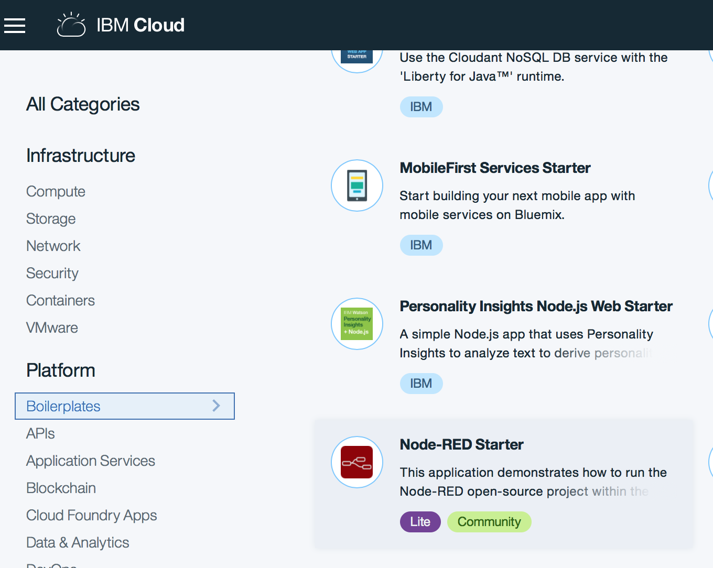
2. Give your application a name and click **Create**.
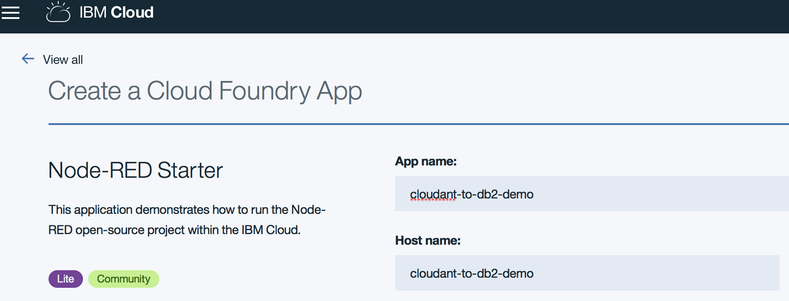
3. From the IBM Cloud dashboard, navigate to the Overview page for your application, then click the `Visit App URL` link to launch Node-RED's main page. It can take a while for the application to start; the green circle and “Running” text will be visible when it’s ready to try.
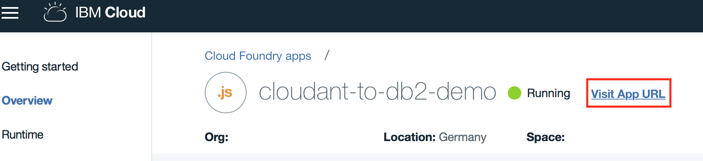
4. The first time you visit the site, you will be asked to do some basic configuration.

    a. Click **Next** and enter a username and password to secure your editor.
    
    b. Skip the `Browse available IBM Cloud nodes` by clicking **Next**.  These are not required for the tutorial.
    
    c. Finally press **Finish** to complete the setup.

Let's now create the `Db2 Warehouse` service and bind it to the Node-RED app:

1. On the IBM Cloud catalog page, open the `Db2` service in the `Data and Analytics` tab:
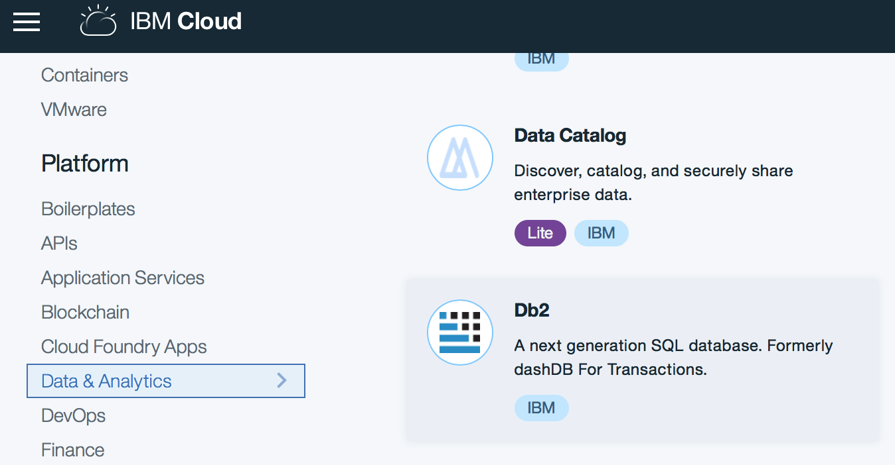
2. In the Db2 service details page, create a lite service plan by pressing **Finish**.
3. On your IBM Cloud dashboard, click on the newly created Node-RED Cloud Foundry app.
4. Click on the **Connections** tab and then click **Create connection**.
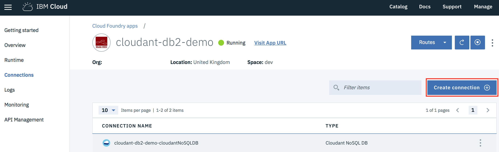
5. Hover your mouse over the existing Db2 Warehouse on Cloud and press **Connect**.
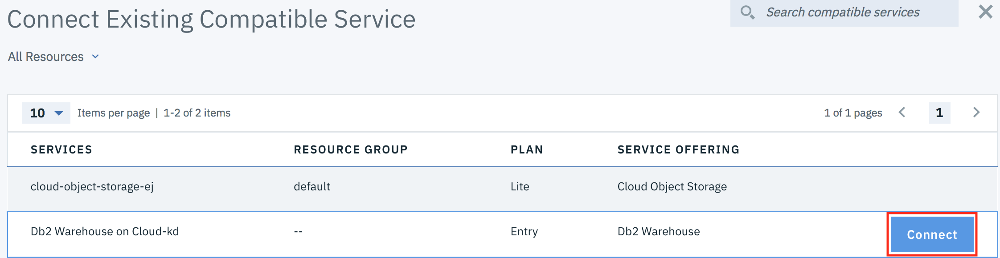
6. Press **Restage** to make the Db2 service available for use in the Node-RED app.
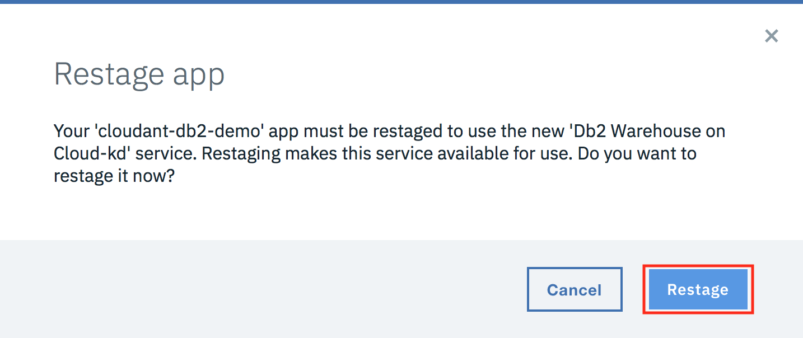

Once that’s done, go back to your Node-RED app and click the `Visit App URL` link to launch Node-RED's main page.

Then, click `Go to your Node-RED flow editor` to open the flow editor.
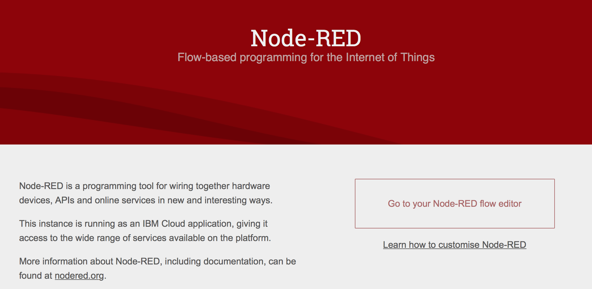

You should see a blank flow where you can start building your app. When using Node-RED we build our apps using this graphical editor interface to wire together the blocks we need. We can simply drag and drop the blocks from the left menu into the workspace in the center of the screen and connect them to create a new flow.
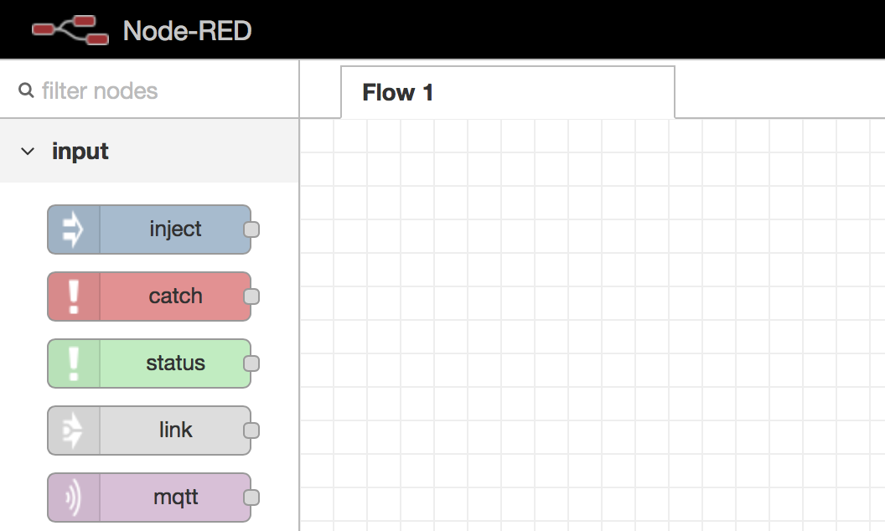

## 2. Import the code

Every Node-RED application can be imported and exported using the JSON format. Follow the steps below to import the app into the new sheet:

1. Open the [cloudant-to-dashdb.json](cloudant-to-dashdb.json) file.
2. Copy the entire file's content, then go back to Node-RED in your browser.
3. Click on the menu button in the top right corner and select `Import from… > Clipboard…`

## 3. Review the Node-RED application
In this section we'll explain the code behind the imported application.

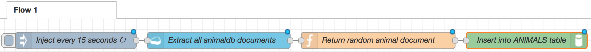

We have four nodes:

1. `Inject` (Inject every 15 seconds)
    
    The `Inject` block will inject a message on a 15 second interval, allowing 
    for continual streaming of data from Cloudant to the Db2 tables.

2. `Cloudant in` (Extract all animaldb documents)

    The `Cloudant in` block with retrieve a random animal doc from the `animaldb` database in the `examples` account.
    
4.  `Function` (Return random animal document)

    The `Function` block will select an animal doc at random (using the built-in `Math` object) and create a new
    JSON object with fields `id`, `rev`, `wiki_page`, `class`, and `diet`:
    ```javascript
    // Select a random doc in the animaldb databse
    var randomDocInt = Math.floor(Math.random() * 13);
    var doc = msg.cloudant.rows[randomDocInt].doc;
    // Only return animal docs
    if (doc.indexOf("_design") === -1) {
      msg.payload = {
          ID: doc._id,
          REV: doc._rev,
          WIKI_PAGE: doc.wiki_page,
          CLASS: doc.class,
          DIET: doc.diet
      }
      return msg;
    }
    ```

5.  `dashDB out` (Insert into ANIMALS table)

    The `dashDB out` block will store the JSON payload into the defined Db2 table.
    
    Note: The Db2 table needs to be created before deploying this app.
    
## 4. Create the Db2 Warehouse on Cloud table 

1. In the IBM Cloud dashboard, go to your Db2 Warehouse on Cloud service.
2. On the **Manage** tab, click the **Open** button:
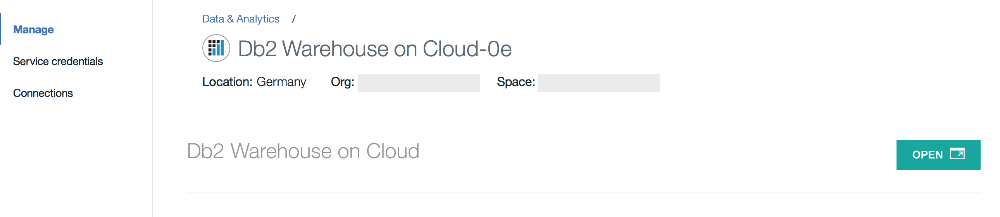
3. In the Db2 console, click on the **Run SQL** tab.
4. Copy the SQL statement below into the editor and press **Run All**.
```
CREATE TABLE ANIMALS (
  ID VARCHAR(255),
  REV VARCHAR(255),
  WIKI_PAGE VARCHAR(255),
  CLASS VARCHAR(255),
  DIET VARCHAR(255)
  )
```

## 5. Deploy and run application
1. Click the red Deploy button next to the menu button to make your application live.
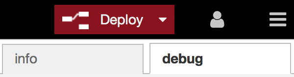
2. You should see a success message appear on the top, and the blue dots on the nodes will disappear. These dots indicate when a node has been changed but not yet deployed.

## 6. View the data in the Db2 Warehouse table
1. In the IBM Cloud dashboard, go to your Db2 Warehouse on Cloud service.
2. On the **Manage** tab, click the **Open** button.
3. In the Db2 console, click on the **Explore** tab and select the schema that matches your username.
4. Select the `ANIMALS` table under the selected schema:
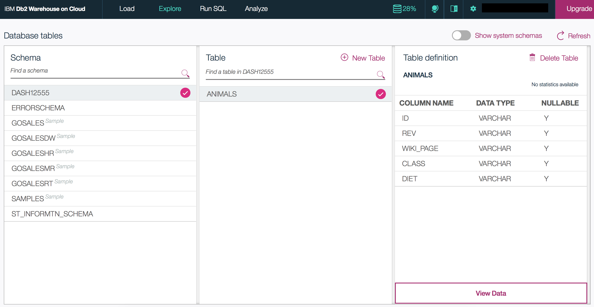
5. Click **View Data** and you should see a list of animal documents:
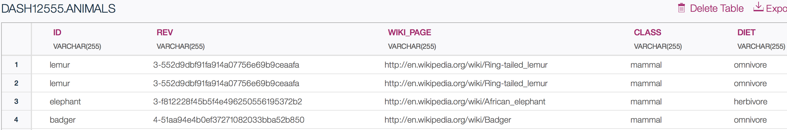

To learn more about Cloudant and work with your own Cloudant database, check out the 
[Cloudant NoSQL DB IBM Cloud service](https://console.bluemix.net/catalog/services/cloudant-nosql-db).
