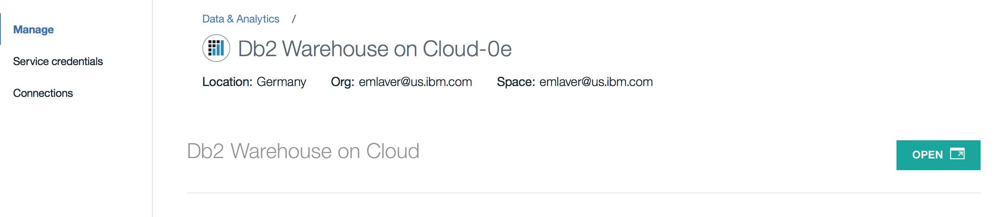

# Simple load from Cloudant to Db2 in Spark using Watson Studio (Scala language)
This tutorial is an introduction on loading Cloudant data into Apache Spark and saving the data into Db2.
In this tutorial you will:

1. Create a Scala notebook to load the Cloudant data in Watson Studio.
2. Save the Apache Spark DataFrame into Db2 Warehouse on Cloud.
3. View the data in the Db2 Warehouse on Cloud table.

## Before you begin 

These are the IBM Bluemix services required to run this tutorial:
1. [Apache Spark](https://console.bluemix.net/catalog/services/apache-spark)
2. [Db2 Warehouse on Cloud](https://console.bluemix.net/catalog/services/dashdb)

Watch the [Getting Started on IBM Cloud](https://developer.ibm.com/clouddataservices/docs/spark/get-started/get-started-in-bluemix/) video to add the IBM Analytics for Apache Spark service to your IBM Cloud account.
You can [download the Scala notebook](animaldb-scala-load-to-dashdb.ipynb) referenced in this tutorial or create your own notebook by 
cutting/pasting the code into a new notebook.

Note: For `Db2 Warehouse on Cloud` service, you'll need to locate and copy the service credentials.
These will be required for saving the Spark data into a Db2 Warehouse table.

### 1. Create a Scala notebook to load the Cloudant data

1. Log in to Watson Studio at https://dataplatform.ibm.com.
2. Create a new notebook, specifying a name, description, Spark service to use, Scala 2.11, and Spark 2.1.
3. Paste the following statement into the first cell, and then click **Run**. 
   This command contains SQLContext which is the entry point into all functionality in Spark SQL and is necessary to 
   execute SQL queries.
   ```
   val sqlContext = new org.apache.spark.sql.SQLContext(sc)
   ```
   
4. Paste the following statement into the second cell, and then click Run. This command reads the `animaldb` database from the Cloudant 
   `examples` account and assigns it to the `cloudantdata` variable.
   ```
   val cloudantdata = sqlContext.read.format("org.apache.bahir.cloudant").
   option("cloudant.host", "examples.cloudant.com").
   load("animaldb")
   ```
   
5. Paste the following statement into the third cell, and then click Run. This next command lets you take a look at that schema. 
   ```
   cloudantdata.printSchema
   ```

### 2. Save the Spark DataFrame into Db2 Warehouse on Cloud

1. Paste the following statement into the fourth cell, and then click Run. This line persists the DataFrame into a Db2 Warehouse table.
This command writes 10 documents into a table named `animaldb`. 
Replace `DB2_JDBC_URL`, `user`, and `password` with fields `jdbcurl`, `username`, and `password` from your Db2 Warehouse service credentials.
```
val connectionProps = new java.util.Properties
connectionProps.setProperty("user", "username")
connectionProps.setProperty("password", "password")
connectionProps.setProperty("driver", "com.ibm.db2.jcc.DB2Driver")

val DB2_JDBC_URL = "jdbc:db2://***:50000/BLUDB"

// Save Spark DataFrame to Db2 Warehouse
cloudantdata.write.jdbc(DB2_JDBC_URL, "animaldb", connectionProps)
```

### 5. View the data in the Db2 Warehouse on Cloud table

1. In the Bluemix dashboard, go to your Db2 Warehouse on Cloud service.
2. On the **Manage** tab, click the **Open** button:

3. In the Db2 console, click on the **Explore** tab and select the schema that matches your username.
4. Select the `ANIMALDB` table under the selected schema and click **View Data**:

5. You should now see a list of ten documents each with a unique animal name:
