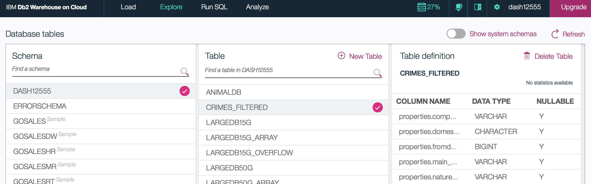

# Load crime data from Cloudant to Db2 in Spark

This Python notebook loads Cloudant documents into Apache Spark, and then saves the Spark DataFrame into a Db2 table.
In this tutorial you will:

1. Load the Cloudant data from the `crimes` database
2. Save the `properties` column in the Spark DataFrame into Db2 Warehouse on Cloud.
3. View the data in the Db2 Warehouse table.


## Before you begin 

These are the services required in your IBM Bluemix account:

1. [Apache Spark](https://console.bluemix.net/catalog/services/apache-spark)
2. [Db2 Warehouse on Cloud](https://console.bluemix.net/catalog/services/dashdb)

Watch the [Getting Started on IBM Cloud](https://developer.ibm.com/clouddataservices/docs/spark/get-started/get-started-in-bluemix/) video to add the IBM Analytics for Apache Spark service to your IBM Cloud account.

Note: For `Db2 Warehouse on Cloud` service, you'll need to locate and copy the service credentials.
These will be required for saving the Spark data into a Db2 Warehouse table.

### 1. Load the Cloudant data from the `crimes` database


```python
# Import and initialize SparkSession
from pyspark.sql import SparkSession
spark = SparkSession\
    .builder\
    .config('cloudant.host', 'examples.cloudant.com')\
    .getOrCreate()

# Load Cloudant documents from 'crimes' into Spark DataFrame
cloudantdata = spark.read.format('org.apache.bahir.cloudant').load('crimes')

# In case of doing multiple operations on a dataframe (select, filter etc.)
# you should persist the dataframe.
# Othewise, every operation on the dataframe will load the same data from Cloudant again.
# Persisting will also speed up computation.
cloudantdata.cache() # persisting in memory
```


    DataFrame[_id: string, _rev: string, geometry: struct<coordinates:array<double>,type:string>, properties: struct<compnos:string,domestic:boolean,fromdate:bigint,main_crimecode:string,naturecode:string,reptdistrict:string,shooting:boolean,source:string>, type: string]


```python
# Print the schema
cloudantdata.printSchema()
```

    root
     |-- _id: string (nullable = true)
     |-- _rev: string (nullable = true)
     |-- geometry: struct (nullable = true)
     |    |-- coordinates: array (nullable = true)
     |    |    |-- element: double (containsNull = true)
     |    |-- type: string (nullable = true)
     |-- properties: struct (nullable = true)
     |    |-- compnos: string (nullable = true)
     |    |-- domestic: boolean (nullable = true)
     |    |-- fromdate: long (nullable = true)
     |    |-- main_crimecode: string (nullable = true)
     |    |-- naturecode: string (nullable = true)
     |    |-- reptdistrict: string (nullable = true)
     |    |-- shooting: boolean (nullable = true)
     |    |-- source: string (nullable = true)
     |-- type: string (nullable = true)
    


### 2. Save the `properties` column in the Spark DataFrame into Db2 Warehouse on Cloud

In preparation of saving the `properties` struct, we need to extract each field since Db2 does not support this data type.

The cell below will:
1. Select only the `properties` column
2. Use `withColumn` to extract and create new columns for each field in `properties`
2. Drop the original `properties` column


```python
propertiesDF = cloudantdata.select('properties')\
.withColumn('properties.compnos', cloudantdata['properties.compnos'])\
.withColumn('properties.domestic', cloudantdata['properties.domestic'])\
.withColumn('properties.fromdate', cloudantdata['properties.fromdate'])\
.withColumn('properties.main_crimecode', cloudantdata['properties.main_crimecode'])\
.withColumn('properties.naturecode', cloudantdata['properties.naturecode'])\
.withColumn('properties.reptdistrict', cloudantdata['properties.reptdistrict'])\
.withColumn('properties.shooting', cloudantdata['properties.shooting'])\
.withColumn('properties.source', cloudantdata['properties.source'])\
.drop('properties')
```

Print the modified schema that will be saved to the Db2 Warehouse:


```python
propertiesDF.printSchema()
```

    root
     |-- properties.compnos: string (nullable = true)
     |-- properties.domestic: boolean (nullable = true)
     |-- properties.fromdate: long (nullable = true)
     |-- properties.main_crimecode: string (nullable = true)
     |-- properties.naturecode: string (nullable = true)
     |-- properties.reptdistrict: string (nullable = true)
     |-- properties.shooting: boolean (nullable = true)
     |-- properties.source: string (nullable = true)
    


We need to run some Scala logic to configure the JDBC dialect for Db2 correctly. Pixiedust provides us a way to do it:


```python
import pixiedust
```

    Pixiedust database opened successfully

Set up the custom Db2 dialect (with proper string type mapping) using PixieDust scala bridge:


```
%%scala cl=dialect global=true
import org.apache.spark.sql.jdbc._
import org.apache.spark.sql.types.{StringType, BooleanType, DataType}

object db2CustomDialect extends JdbcDialect {
    override def canHandle(url: String): Boolean = url.startsWith("jdbc:db2")
    override def getJDBCType(dt: DataType): Option[JdbcType] = dt match {
            case StringType => Option(JdbcType("VARCHAR(50)", java.sql.Types.VARCHAR))
            case BooleanType => Option(JdbcType("CHAR(1)", java.sql.Types.CHAR))
            case _ => None
    }
}
JdbcDialects.registerDialect(db2CustomDialect)
```

The cell below persists the modified DataFrame into a Db2 Warehouse table.

Replace `db2_jdbc_url`, `user`, and `password` with fields `jdbcurl`, `username`, and `password` from your Db2 Warehouse service credentials.


```python
conn_properties = {
   'user': 'username',
   'password': 'password',
   'driver': 'com.ibm.db2.jcc.DB2Driver'
}

db2_jdbc_url = 'jdbc:db2://***:50000/BLUDB'

# Save Spark DataFrame to Db2 Warehouse
propertiesDF.write.jdbc(db2_jdbc_url, 'crimes_filtered', properties=conn_properties)
```

### 3. View the data in the Db2 Warehouse table
1. In the Bluemix dashboard, go to your Db2 Warehouse on Cloud service.
2. On the **Manage** tab, click the **Open** button:

3. In the Db2 console, click on the **Explore** tab and select the schema that matches your username.
4. Select the `CRIMES_FILTERED` table under the selected schema:

5. Click **View Data** and you should see a list of documents:


To learn more about Cloudant and work with your own Cloudant database, check out the 
[Cloudant NoSQL DB IBM Bluemix service](https://console.bluemix.net/catalog/services/cloudant-nosql-db).
