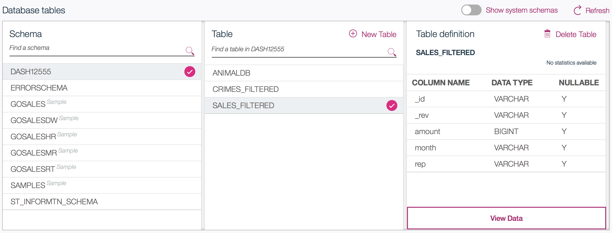
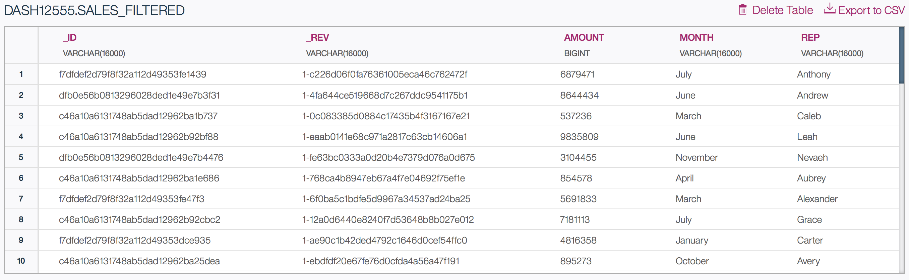

# Load filtered sales data from Cloudant to Db2 in Spark

This notebook uses Spark Streaming to load Cloudant documents into Apache Spark, and then save the Spark DataFrame into a Db2 Warehouse table.

## Before you begin 

These are the services required in your IBM Bluemix account:

1. [Apache Spark](https://console.bluemix.net/catalog/services/apache-spark)
2. [Db2 Warehouse on Cloud](https://console.bluemix.net/catalog/services/dashdb)

Watch the [Getting Started on IBM Cloud](https://developer.ibm.com/clouddataservices/docs/spark/get-started/get-started-in-bluemix/) video to add the IBM Analytics for Apache Spark service to your IBM Cloud account.

Note: For `Db2 Warehouse on Cloud` service, you'll need to locate and copy the service credentials.
These will be required for saving the Spark data into a Db2 Warehouse table.

The cell below will set up the custom Db2 dialect (with proper string type mapping):


```scala
import org.apache.spark.sql.jdbc._
import org.apache.spark.sql.types.{StringType, BooleanType, DataType}

object db2CustomDialect extends JdbcDialect {
    override def canHandle(url: String): Boolean = url.startsWith("jdbc:db2")
    override def getJDBCType(dt: DataType): Option[JdbcType] = dt match {
            case StringType => Option(JdbcType("VARCHAR(50)", java.sql.Types.VARCHAR))
            case BooleanType => Option(JdbcType("CHAR(1)", java.sql.Types.CHAR))
            case _ => None
    }
}
JdbcDialects.registerDialect(db2CustomDialect)
```

The cell below will use Spark Streaming to continuously load Cloudant documents from the `_changes` endpoint:


```scala
import java.util.Properties

import play.api.libs.json._

import org.apache.spark.rdd.RDD
import org.apache.spark.SparkConf
import org.apache.spark.sql.SparkSession
import org.apache.spark.streaming.{Seconds, StreamingContext}

import org.apache.bahir.cloudant.CloudantReceiver

val spark = SparkSession.builder().appName("Load Cloudant docs into Spark").getOrCreate()

// Create the context with a 10 second batch size
val ssc = new StreamingContext(spark.sparkContext, Seconds(10))  

val changes = ssc.receiverStream(new CloudantReceiver(spark.sparkContext.getConf, Map(
  "cloudant.host" -> "examples.cloudant.com",
  "database" -> "sales")))

// Replace DB2_JDBC_URL, user, and password with fields jdbcurl, username, and password from your Db2 Warehouse service credentials
val props = new Properties
props.setProperty("user", "username")
props.setProperty("password", "password")
props.setProperty("driver", "com.ibm.db2.jcc.DB2Driver")

val DB2_JDBC_URL = "jdbc:db2://***:50000/BLUDB"

changes.foreachRDD((rdd: RDD[String]) => {
  val df = spark.read.json(rdd)
  if (df.schema.nonEmpty) {
    // Select only _id, _rev, amount, month, and rep fields from 'sales' DataFrame
    val salesFilteredDF = df.selectExpr(
        "_id",
        "_rev",
        "amount",
        "month",
        "rep"
    )
    // Save Spark DataFrame to Db2 warehouse
    salesFilteredDF.write.jdbc(DB2_JDBC_URL, "sales_filtered", props)
  }
})

ssc.start
// Run streaming for 20 seconds or until terminated by user
ssc.awaitTerminationOrTimeout(20000L)
```

### View the table in the Db2 Warehouse console
1. In the Bluemix dashboard, go to your Db2 Warehouse on Cloud service.
2. On the **Manage** tab, click the **Open** button.
3. In the DB2 console, click on the **Explore** tab and select the schema that matches your username.
4. Select the `SALES_FILTERED` table under the selected schema:

5. Click **View Data** and you should see a list of documents:


