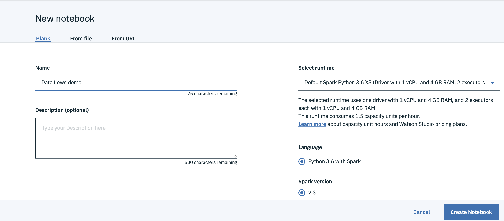

### Install Apache Bahir's sql-cloudant in a Python notebook
1. Log in to Watson Studio at https://dataplatform.ibm.com.
1. Create a new notebook, specifying a name and description.  Select the `Default Spark Python 3.6` runtime and then select 
   `Create Notebook`.
   
1. Run the import statement below in the first cell.  We'll use this Python tool to install the required `sql-cloudant` library.
   ```
   import pixiedust
   ```
   Once you've run the cell, restart the kernel by clicking the `Kernel` toolbar item and selecting `Restart & Clear Output`.
1. Install [Apache Bahir's `sql-cloudant`](https://github.com/apache/bahir/tree/master/sql-cloudant) library in the next cell
   by using [Pixiedust's package manager](https://github.com/pixiedust/pixiedust/wiki/Package-Manager).
   ```
   pixiedust.installPackage("org.apache.bahir:spark-sql-cloudant_2.11:2.3.3")
   ```
   Restart the kernel after you've run the cell.
